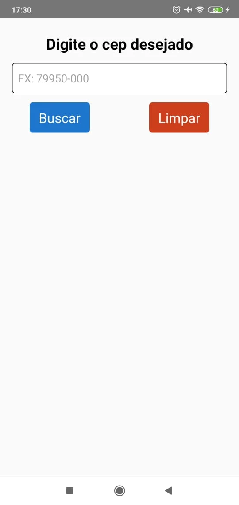
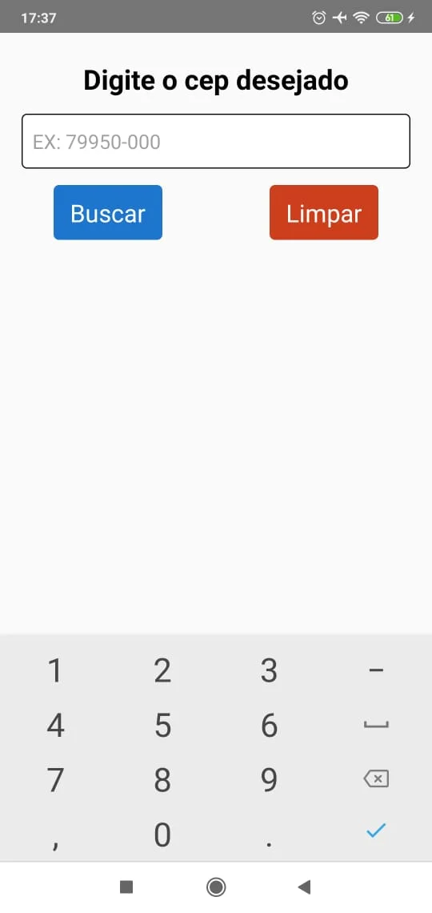
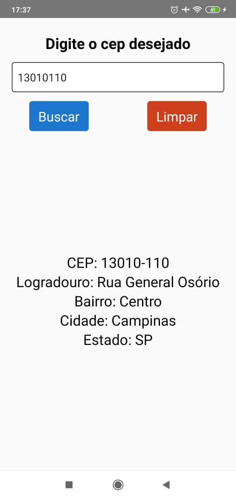

<h1 align="center">CepApp</h1>

<h1 align="center">

App para realizar consultas de algumas informações como ( Logradouro, Bairro, Cidade e UF) através do cep informado.

</h1>

<h4 align="center"> 
	🚧  CepApp 🚀 Em construção...  🚧
</h4>

<h1 align="center">
  
  
  
</h1>

## 🛠 Tecnologias

A ferramenta que foi usada na construção do projeto:

✔️ [React Native](https://reactnative.dev/)
✔️ [Axios](https://github.com/axios/axios)

## 🦸 Autor

 

